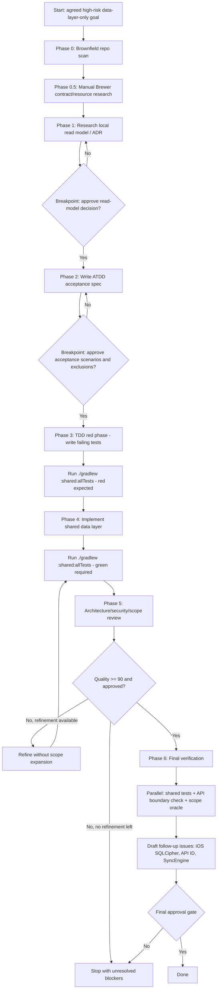
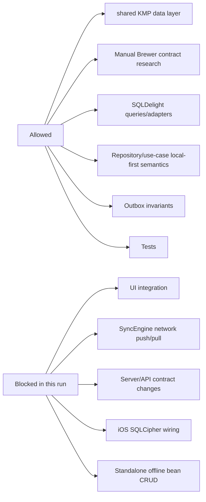

# Local-first Brew-log Data Layer — Process Diagram

```mermaid
flowchart TD
    A[Start: agreed high-risk data-layer-only goal] --> B[Phase 0: Brownfield repo scan]
    B --> B2[Phase 0.5: Manual Brewer contract/resource research]
    B2 --> C[Phase 1: Research local read model / ADR]
    C --> D{Breakpoint: approve read-model decision?}
    D -- No --> C
    D -- Yes --> E[Phase 2: Write ATDD acceptance spec]
    E --> F{Breakpoint: approve acceptance scenarios and exclusions?}
    F -- No --> E
    F -- Yes --> G[Phase 3: TDD red phase - write failing tests]
    G --> H[Run ./gradlew :shared:allTests - red expected]
    H --> I[Phase 4: Implement shared data layer]
    I --> J[Run ./gradlew :shared:allTests - green required]
    J --> K[Phase 5: Architecture/security/scope review]
    K --> L{Quality >= 90 and approved?}
    L -- No, refinement available --> M[Refine without scope expansion]
    M --> J
    L -- No, no refinement left --> N[Stop with unresolved blockers]
    L -- Yes --> O[Phase 6: Final verification]
    O --> P[Parallel: shared tests + API boundary check + scope oracle]
    P --> Q[Draft follow-up issues: iOS SQLCipher, API ID, SyncEngine]
    Q --> R{Final approval gate}
    R -- No --> N
    R -- Yes --> S[Done]
```

## Explicit scope guards

```mermaid
flowchart LR
    A[Allowed] --> A1[shared KMP data layer]
    A --> A0[Manual Brewer contract research]
    A --> A2[SQLDelight queries/adapters]
    A --> A3[Repository/use-case local-first semantics]
    A --> A4[Outbox invariants]
    A --> A5[Tests]

    B[Blocked in this run] --> B1[UI integration]
    B --> B2[SyncEngine network push/pull]
    B --> B3[Server/API contract changes]
    B --> B4[iOS SQLCipher wiring]
    B --> B5[Standalone offline bean CRUD]
```
